# Linux Security Lab

A hands-on cybersecurity home lab demonstrating a full attack-detection-response pipeline using industry-standard open-source and enterprise tools.

## Architecture

| VM | OS | IP | Role |
|---|---|---|---|
| target | Ubuntu 26.04 | 192.168.120.129 | Hardened server (victim) |
| attacker | Ubuntu 26.04 | 192.168.120.130 | Attack simulation |
| wazuh | Ubuntu 22.04 | 192.168.120.134 | SIEM server |

All VMs run in VMware with NAT networking.

---

## What Was Built

### 1. CIS Hardening (Lynis score: 57 → 73)
Applied CIS Benchmark hardening to the target server:
- **SSH hardening**: PermitRootLogin disabled, MaxAuthTries 3, key-only authentication
- **sysctl kernel hardening**: SYN flood protection, IP spoofing prevention, ICMP redirect blocking
- **Password policy**: 12+ characters, 3 character classes, 90-day rotation (pwquality + login.defs)
- **UFW firewall**: Default deny, port 22 only
- **auditd**: Monitoring auth.log, sshd_config, sudoers, passwd
- **Disabled services**: avahi-daemon, cups
- **rkhunter**: Rootkit scanner
- **Login banner**: Authorized access warning

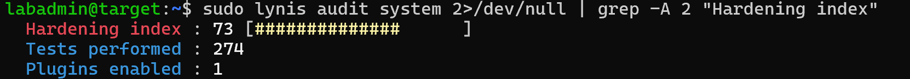
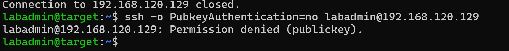

### 2. Brute Force Attack + Detection
- Simulated SSH brute force attack using **Hydra** from attacker VM
- **Fail2ban** automatically banned attacker IP after 3 failed attempts
- Auth.log evidence captured and verified

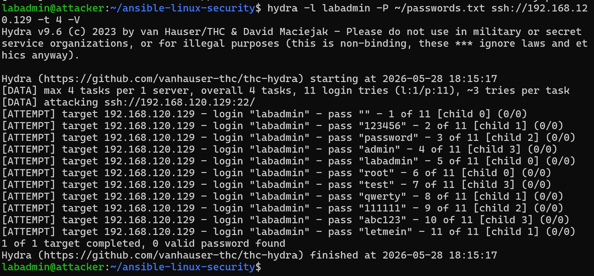
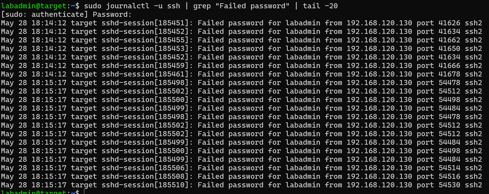
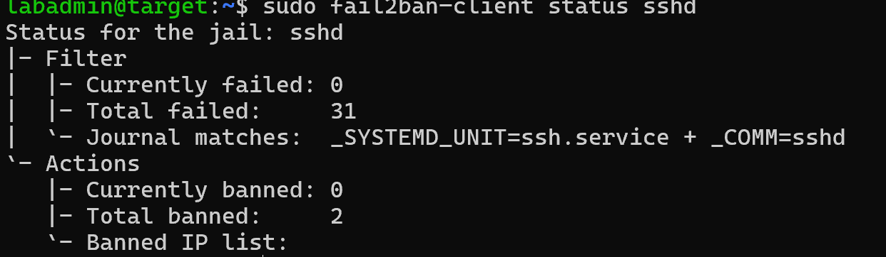

### 3. File Integrity Monitoring (AIDE)
- Initialized AIDE database baseline
- Demonstrated detection of unauthorized file changes
- Created test intrusion file — AIDE detected the modification

### 4. Vulnerability Scanning (Nmap)
- Basic port scan: only port 22/tcp open (firewall working)
- Vulnerability scan (`--script vuln`): **0 vulnerabilities found**

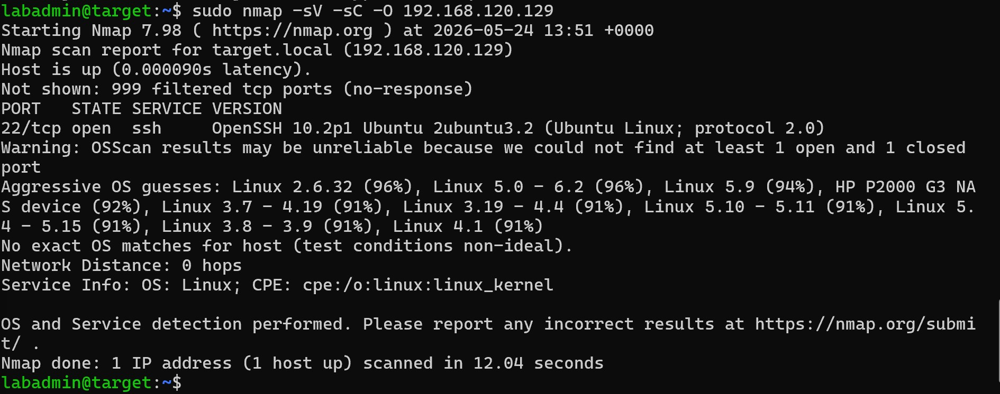
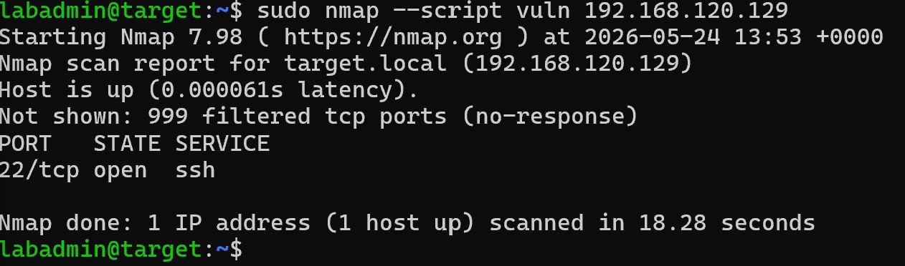

### 5. Wazuh SIEM
- Deployed Wazuh 4.14.5 all-in-one on dedicated Ubuntu 22.04 VM
- Installed Wazuh Agent on target server
- Hydra brute force attack generated **14 Authentication Failure alerts**
- MITRE ATT&CK classification: **T1110 - Brute Force / Password Guessing**

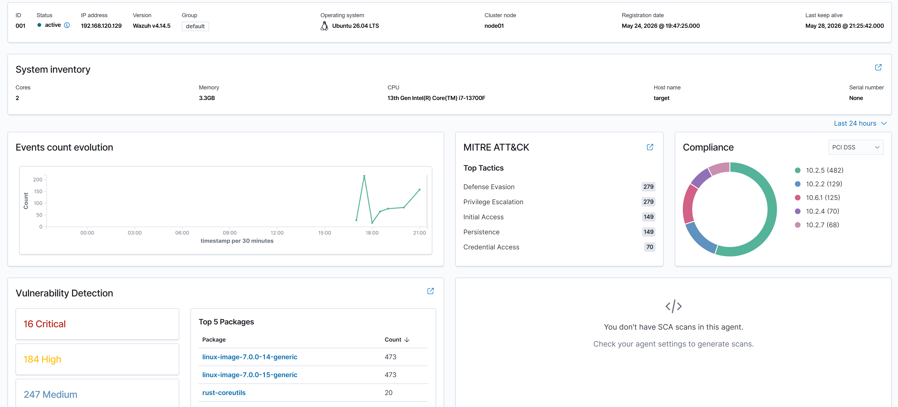
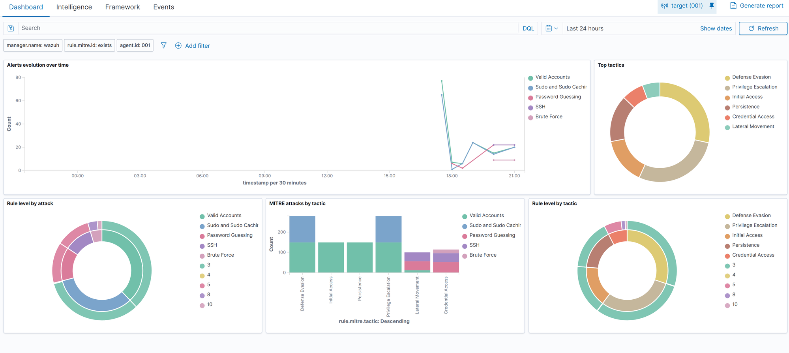
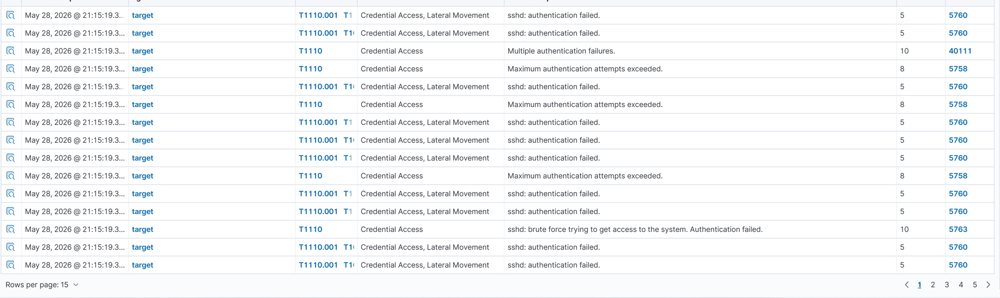

### 6. Microsoft Sentinel Integration
- Created Log Analytics Workspace connected to Microsoft Sentinel
- Built custom Python integration script (Wazuh → Azure Log Analytics HTTP API)
- Brute force alerts from target VM visible in Sentinel with srcip/dstip mapping
- Custom Analytics Rule: detects known malicious IP (192.168.120.130)
- Threat Intelligence indicator imported for attacker IP (Confidence: 90, TLP: Red)

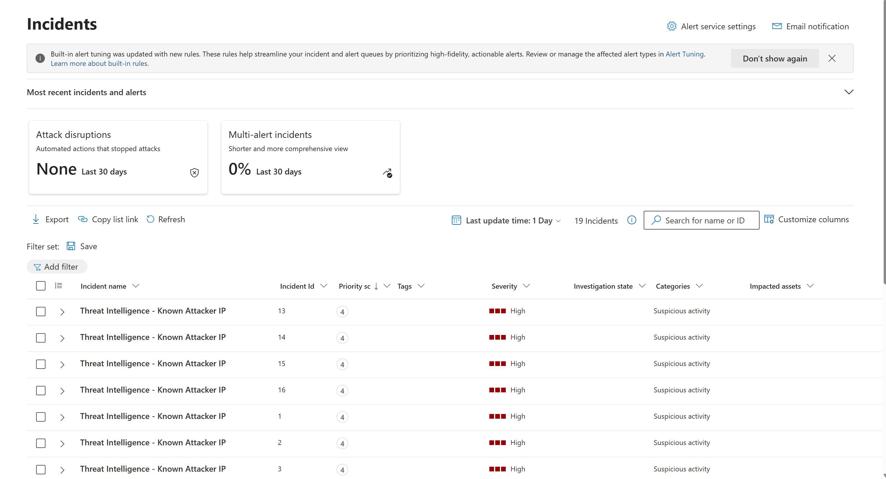
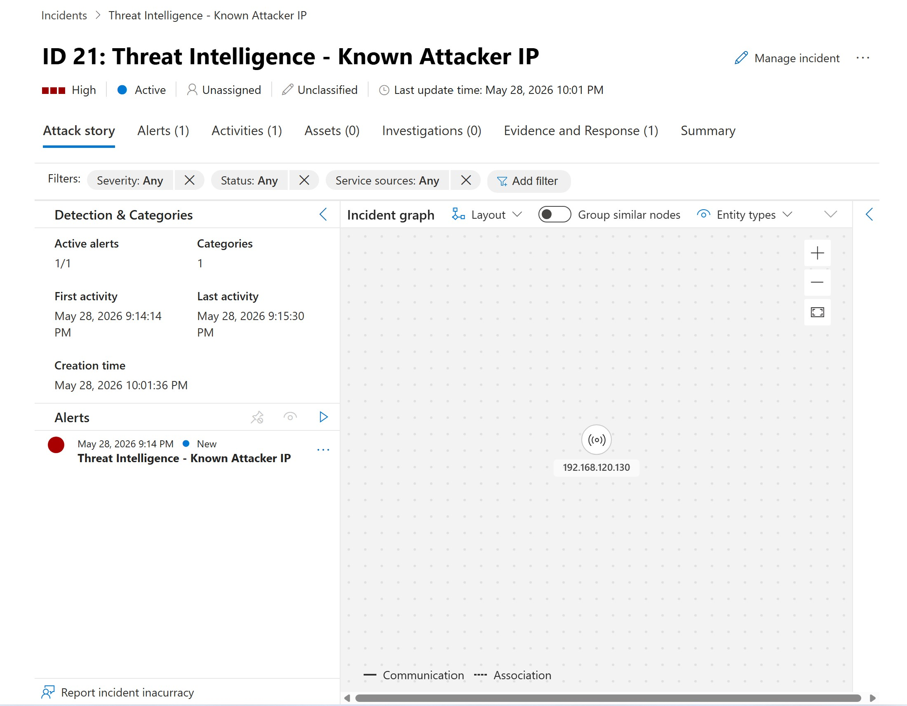

### 7. Ansible Roles (Compliance as Code)
Automated the entire hardening process using Ansible with 3 roles:

```
ansible-linux-security/
├── inventory/hosts.yml
├── playbook.yml
├── ansible.cfg
├── group_vars/all/
│   ├── vars.yml
│   └── vault.yml          <- AES256 encrypted credentials (Ansible Vault)
└── roles/
    ├── cis-hardening/     <- SSH, sysctl, auditd, UFW, password policy
    ├── fail2ban/          <- Brute force protection
    └── wazuh-agent/       <- SIEM agent deployment
```

- Idempotent: safe to run multiple times (`changed=0` on second run)
- Secrets encrypted with **Ansible Vault** (AES256)
- One command deploys a fully hardened and monitored server:

```bash
ansible-playbook -i inventory/hosts.yml playbook.yml --vault-password-file ~/.vault_pass
```

### 8. WAF — ModSecurity + OWASP Core Rule Set
- Deployed nginx with **ModSecurity v1.0.3**
- Loaded **924 OWASP CRS 3.3.8 rules**
- Demonstrated blocking of:
  - SQL Injection: `?id=1+UNION+SELECT+1,2,3--` → **403 Forbidden** (Anomaly Score: 18)
  - XSS: `?search=<script>alert('xss')</script>` → **403 Forbidden**

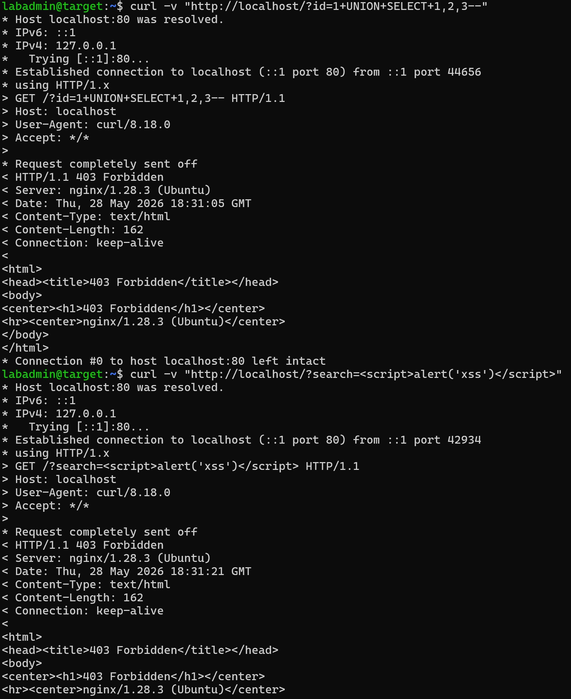

### 9. Privilege Escalation Demo
Demonstrated sudo misconfiguration exploitation (GTFOBins technique):

```bash
# Vulnerable sudo rule (misconfiguration)
labadmin ALL=(ALL) NOPASSWD: /usr/bin/find

# Exploitation
sudo find . -exec /bin/bash \; -quit
whoami  # root
```

All privilege escalation activity logged in auth.log and forwarded to Wazuh/Sentinel.

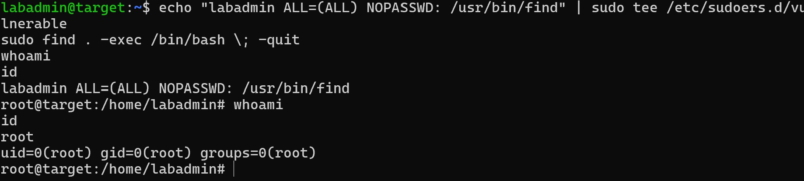

---

## Attack → Detection Pipeline

```
Attacker VM           Target VM              Wazuh SIEM         Microsoft Sentinel
     |                    |                       |                      |
     |-- Hydra attack --> |                       |                      |
     |               Fail2ban bans IP             |                      |
     |               auth.log updated             |                      |
     |                    |-- Wazuh Agent ------> |                      |
     |                    |                  Alert created               |
     |                    |                  MITRE T1110                 |
     |                    |                       |-- Python script ----> |
     |                    |                       |              WazuhAlerts_CL
     |                    |                       |              Analytics Rule
     |                    |                       |              Incident created
```

---

## Technologies Used

| Category | Tool |
|---|---|
| Attack simulation | Hydra, Nmap |
| Host hardening | CIS Benchmark, sysctl, UFW, auditd, Fail2ban, rkhunter |
| File integrity | AIDE |
| SIEM | Wazuh 4.14.5, Microsoft Sentinel |
| WAF | ModSecurity + OWASP CRS 3.3.8 |
| Automation | Ansible 2.20, Ansible Vault |
| Cloud | Azure Log Analytics, Microsoft Sentinel |
| OS | Ubuntu 26.04, Ubuntu 22.04 |
| Virtualization | VMware Workstation |

---

## Key Security Concepts Demonstrated

- **Defense in depth**: Multiple security layers (firewall → WAF → SIEM → alerting)
- **MITRE ATT&CK framework**: Real-time attack classification
- **Compliance as Code**: Automated CIS hardening via Ansible roles
- **Threat Intelligence**: Custom IOC indicators in Microsoft Sentinel
- **Idempotency**: Ansible ensures consistent server state
- **Secrets management**: Ansible Vault for encrypted credentials

---

## Notes

- In production, Ansible would use a dedicated service account with restricted NOPASSWD commands
- WAF rules require tuning in production to avoid false positives (DetectionOnly period recommended before enabling blocking mode)
- Wazuh → Sentinel integration uses the HTTP Data Collector API; production deployments should migrate to DCR-based ingestion before September 2026
